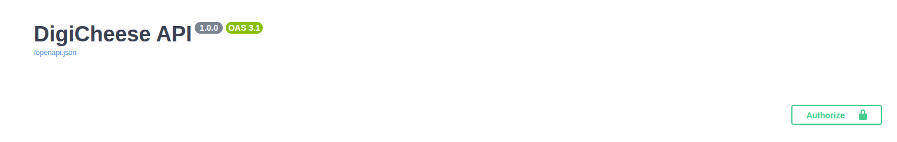

# DIGICHEESE — TP Diginamic (UML + socle dev)

## Sommaire

  1. Contexte
  2. Objectifs pédagogiques
  3. Arborescence du projet
  4. Organisation du projet
  5. Guide d'utilisation

--------------------

## 1. Contexte
DIGICHEESE est une fromagerie régionale (≈ 130 salariés), entreprise familiale de plus d’un siècle,
qui vend ses produits :
- aux grands distributeurs
- aux particuliers qui se rendent physiquement à la boutique de l’usine

Ce dépôt est réalisé dans le cadre d’un **TP de la formation Diginamic**.
L’objectif est de produire des livrables structurés (UML, scénarios, conception) et de préparer un socle
de développement exploitable (architecture, tests, exécution).

> Statut : TP pédagogique (prioritaire) + socle dev (évolutif)

---

## 2. Objectifs pédagogiques
- Modéliser un besoin métier (acteurs, cas d’utilisation, scénarios)
- Produire des diagrammes UML (use case, séquence, activité, classes / ERD selon sujet)
- Structurer un projet comme un vrai dépôt de développement :
  - séparation des responsabilités (routes / services / repositories)
  - configuration
  - tests automatisés de base
  - documentation (fonctionnelle, technique et d’utilisation)

#### Livrables attendus (rappel consignes)
- Code Python structuré par projet (**src/** + scripts associés si besoin)
- Tests : scénarios + scripts (dossier **tests/** + éventuellement scripts d’exécution)
- Documentation :
  - **DOC/** : documentation technique + documentation d’utilisation (avec un README équipe/rôles)
  - **DOC/TECH/** : architecture, éléments modifiés selon le cahier des charges, description des environnements Python

---

## 3. Arborescence (principale)
- `src/` : code source (structure imposée par le cours)
  - `routes/` : endpoints / contrôleurs
  - `services/` : logique métier
  - `repositories/` : accès données
  - `models/` : modèles et structures
  - `conf/` : configuration
  - `utils/` : utilitaires
- `tests/` : tests automatisés (pytest)
- `DOC/` : documentation projet (évolutive)
  - `DOC/README.md` : doc centrale + équipe / rôles + index
  - `DOC/FONC/` : documentation fonctionnelle (contexte, périmètre, règles métier, parcours, backlog)
  - `DOC/UTILISATION/` : documentation d’utilisation (guide, FAQ)
  - `DOC/TECH/` : documentation technique (architecture, changements CDC, environnements Python)
- `UML/` : livrables UML + exports (peut contenir des éléments d’un autre cours)
- `docs_cours/` : supports / notes / documents liés aux cours

➡️ Point d’entrée documentation : **`DOC/README.md`**

------------

## 4. Organisation du projet

#### a. Résumé du projet

- Backend API Python + MySQL
- CRUD (Create Read Update Delete)
- Documentation Swagger
- Tests via Pytest / unittest

> **MVP attendu**:
>
> CRUD Admin (swagger)
>
> CRUD Operateur Colis (Gestion client)
>
> Une branche par développeur et les branches : test, dev, prod et master
>
> Sources python par projet (SOURCES PYTHON, Scripts, Mysql)
>
> Un dossier avec la documentation technique et d’utilisation (Dans un README.md avec présentation de l’équipe et leur rôle)
>
> Un dossier contenant les scénarii de tests et les scripts
>
> Un dossier contenant la documentation technique (contenant l’architecture, les éléments changés selon le cahier des charges fournis, la description des serveurs virtuels python)

#### b. Mise en place

1. setup GitHub
2. Création de branches par dev
3. Création d'autres branches (dev etc..)
4. Définition des besoins clients
5. Définition de l'env de travail (bibliotheque, technologies, etc.. )
6. Création d'un backlog (tout ce qui est nécessaire a réaliser le projet)
7. Relevé des paramètres (classes, methodes)
8. Définir les étapes de devs
9. Assignation des taches (sprint backlog)

## 5. Guide d'utilisation du projet

#### a. Pré-requis
- Python 3.x
- Git
- Docker et docker compose


#### b. Installation (Windows — PowerShell / Git Bash)
Créer l’environnement virtuel :

```bash
python -m venv .venv
pip install -r requirements.txt
```

#### c. Base de données

Lancer le docker compose :

```bash
docker compose up -d
```

> *Si vous souhaitez reset entièrement la base que vous avez déjà :*
> ```bash
> docker compose down -v
> ```
> *puis rallumez votre compose avec la commande ci-dessus*

###### 1. MySQL

Grâce a ce compose, vous pouvez interagir directement avec votre bdd via mysql avec :

```bash
docker exec -it digicheese-mysql bash
```

Une fois dans le container, vous pouvez accéder à la base avec :

```bash
mysql -u group2 -p
password: digicheese
USE digicheese;
```

###### 2. phpMyAdmin

Pour une représentation graphique, vous avez également accès à un server phpMyAdmin exposé ici :

- URL : http://localhost:8080
- Serveur : mysql
- Utilisateur : group2
- Mot de passe : digicheese

#### d. Démarrage du server FastAPI

Le script de démarrage du server ```src.main``` contient un autre script : ```src.utils.create_db```

C'est ici qu'on créer une instance de notre base.
Comme les routes sont protégés, on fait un seed de base avec un admin et les différents rôles déjà pré - remplis

```bash
uvicorn src.main:app --reload
```

#### e. Navigation dans Swagger

Tout en haut de swagger, vous avez une route ```get_api_key```.
Vous pouvez récupérer l'api_key de l'admin (**id_user = 1**)

Copier coller cet API_KEY dans l'encart Authorize tout en haut de la fenêtre swagger.



Voter session est désormais activée avec le rôle Admin. Vous pouvez maintenant créer un utilisateur, avec un autre rôle, et refaire de même pour utiliser une session OP-COLIS par exemple.

**Recommandation de navigation pour la gestion de client :**

- Créer d'abord une commune
- Puis créer une adresse
- Puis enfin, vous pouvez lier votre client à une ou plusieurs adresses

#### f. Tests automatisés

**Lancer un test entier :**

```bash
cd tests
pytest test_feature.py
```

**Lancer un test en particulier :**

```bash
cd tests
pytest test_feature.py -k nom_du_test
```

#### g. Fermer le projet

```bash
docker compose down #(-v pour supprimer la base)
```

+ 'CTRL + C' sur le terminal du server pour fermer le server
