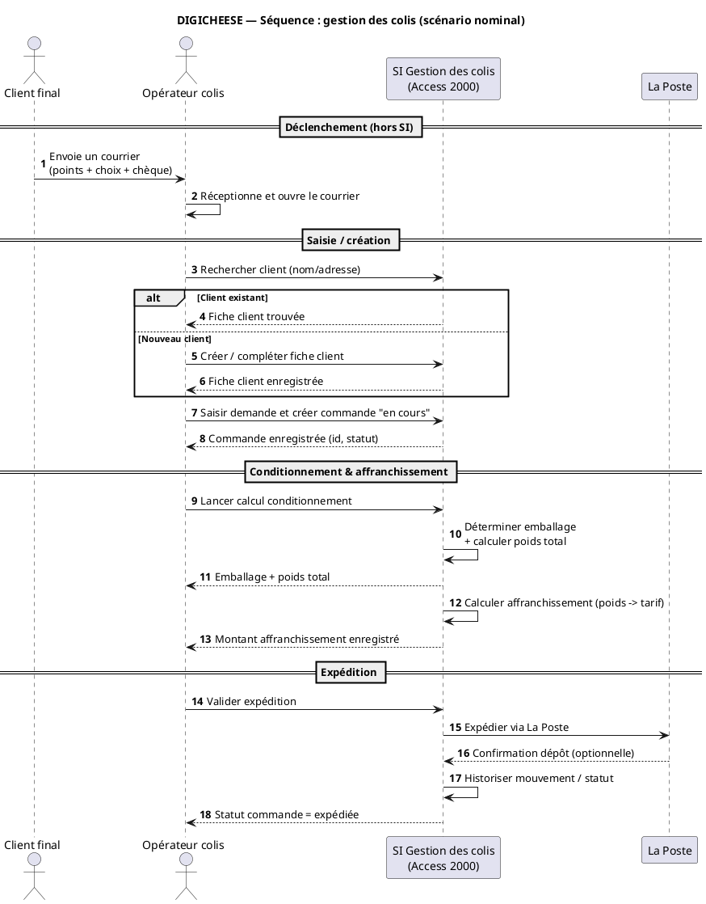
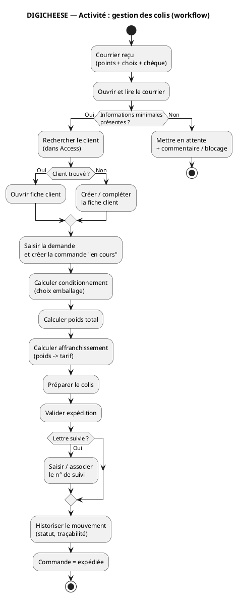

* **Scénario nominal** (le “happy path”)
* * **variantes/branches** (papier libre, lettre suivie, infos manquantes, stock indisponible…)

Et ensuite tu le représentes avec :

* **diagramme de séquence** = *qui échange quoi, dans quel ordre* (acteur ↔ système)
* **diagramme d’activité** = *le workflow + les décisions (if/else)*

Je te propose ci-dessous :

1. un **scénario textuel** propre (basé sur tes UC01→UC07, UC04/UC05/UC06)
2. un **diagramme de séquence PlantUML**
3. un **diagramme d’activité PlantUML**
   (le tout strictement dans le périmètre “gestion des colis” / ancien système)

---

## 1) Scénario textuel — Gestion des colis (scénario nominal)

### Objectif

Traiter une demande client reçue par courrier et expédier le colis via La Poste, avec traçabilité.

### Acteurs / systèmes impliqués

* **Client final** (externe) : déclenche la demande par courrier
* **Opérateur colis** (interne SI) : saisie, préparation, expédition
* **Système Access 2000** : enregistrement, calculs, historisation
* **La Poste** (externe) : transport + tarifs (et suivi si lettre suivie)

### Déclencheur

Réception d’un courrier client contenant points + choix goodies + chèque (frais de port).

### Préconditions

* Le courrier est lisible (choix + coordonnées minimales)
* Les référentiels (emballages, poids goodies, tarifs postaux) sont à jour

### Scénario nominal (Happy path)

1. L’opérateur colis ouvre le courrier et relève les informations (client, adresse, choix goodies, éléments de paiement).
2. Dans Access, il recherche le client :

   * s’il existe : il ouvre la fiche
   * sinon : il crée la fiche client.
3. L’opérateur saisit la demande et crée/complète la commande “en cours” (lignes goodies, commentaires).
4. Il lance le calcul de conditionnement :

   * le système détermine l’emballage,
   * calcule le poids total (emballage + contenu).
5. Le système calcule l’affranchissement à partir des tarifs postaux.
6. L’opérateur prépare le colis et valide l’expédition.
7. Le système enregistre l’expédition et historise le mouvement (traçabilité).
8. La commande est mise à jour (statut “expédiée” / clôture selon règles).

### Postconditions

* Commande expédiée et tracée
* Données consultables (commande + historisation + éventuels rapports)

---

## 2) Diagramme de séquence (PlantUML) — scénario nominal

👉 Copie/colle :

✅ Ce diagramme montre bien :

* la **responsabilité** (opérateur déclenche, SI calcule/enregistre)
* les **interactions** SI ↔ La Poste
* l’alternative “client existant / nouveau client”

---

## 3) Diagramme d’activité (PlantUML) — workflow + décisions

👉 Copie/colle :

✅ Ici tu as :

* les décisions clés (infos minimales, client existant, lettre suivie)
* un vrai **workflow**, plus adapté que le diagramme de séquence pour les branches

