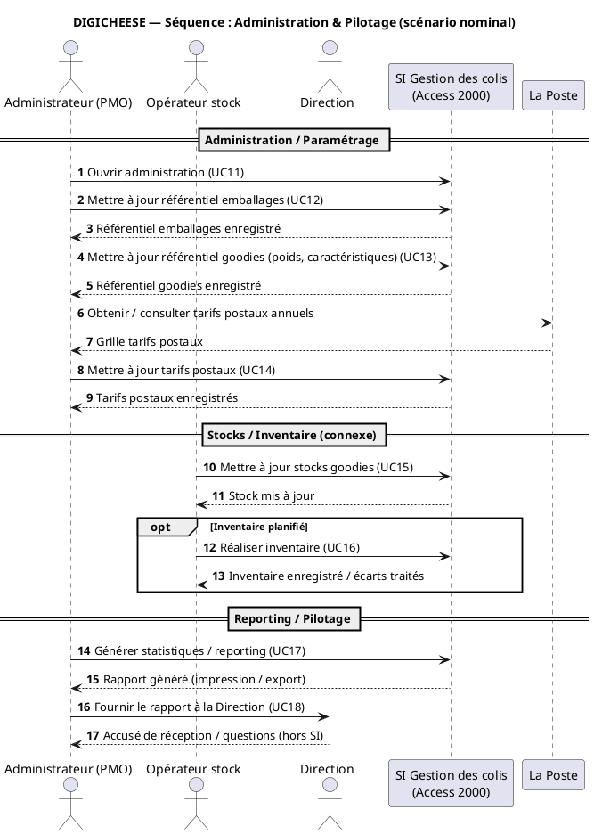
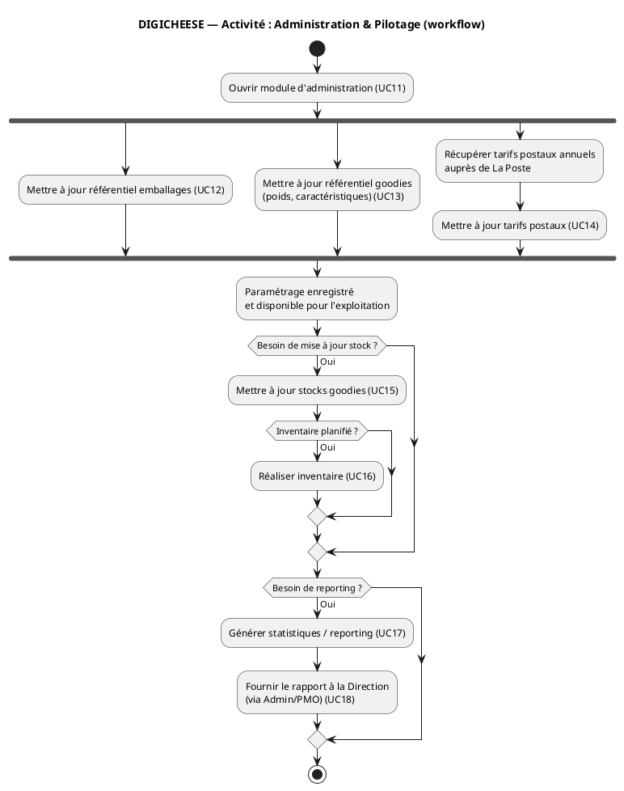

## 1) Scénario textuel — Administration & Pilotage (scénario nominal)

### Objectif

Assurer le bon fonctionnement de la gestion des colis en maintenant les référentiels (emballages, goodies, tarifs postaux), en pilotant les stocks/inventaires, et en produisant des rapports destinés à la Direction (via l’Admin/PMO).

### Acteurs / systèmes impliqués

* **Administrateur (PMO)** (interne SI) : paramétrage + reporting + transmission à la direction
* **Opérateur stock** (connexe) : mise à jour stock + inventaires
* **La Poste** (externe) : source des tarifs postaux annuels
* **Direction / management** (connexe) : consomme les rapports via l’Admin/PMO
* **Système Access 2000** : stockage des référentiels, calculs, reporting

### Déclencheurs (exemples)

* Mise à jour annuelle des **tarifs postaux** (nouvelle grille La Poste)
* Ajout/modification d’un **goodie** (poids/caractéristiques)
* Mise à jour du référentiel **emballages** (nouveaux formats/règles)
* Besoin périodique de **reporting** (mensuel/annuel)
* Réalisation d’un **inventaire** (périodique) ou correction de stock

### Préconditions

* Droits admin disponibles pour l’Administrateur
* Accès au référentiel La Poste (tarifs) pour l’Admin
* Données de commandes/expéditions existantes pour le reporting

### Scénario nominal (Happy path)

1. L’Administrateur (PMO) ouvre le module d’administration.
2. Il met à jour les référentiels :

   * emballages,
   * goodies (poids),
   * tarifs postaux annuels (selon La Poste).
3. Le système enregistre et rend ces paramètres disponibles à l’exploitation.
4. L’Opérateur stock met à jour le stock goodies et réalise un inventaire si prévu.
5. L’Administrateur génère un reporting (mois/année) depuis les données du système.
6. Il fournit le rapport à la Direction (export/impression/transmission).

### Postconditions

* Référentiels à jour (emballages, goodies, tarifs)
* Stocks/inventaires enregistrés
* Rapports disponibles et transmis à la Direction via Admin/PMO

---

## 2) Diagramme de séquence — Administration & Pilotage (PlantUML)

✅ Points clés :

* La **Direction** ne touche pas le SI.
* La Poste intervient uniquement pour **fournir les tarifs** (source).
* L’inventaire est modélisé en **opt** (optionnel / périodique).

---

## 3) Diagramme d’activité — Administration & Pilotage (PlantUML)

✅ Points clés :

* Les mises à jour référentiels peuvent être vues comme **parallélisables** (fork), ce qui rend le diagramme très lisible.
* Stock/inventaire et reporting apparaissent comme **conditions** (périodiques, “selon besoin”).

